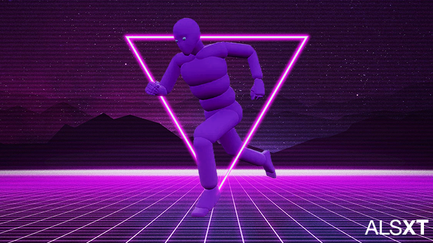

# Advanced Locomotion System Refactored XT

An Unreal Engine 5 plugin that extends Advanced Locomotion System Refactored with expanded Character States, Improved Foot Print system, Sliding, Vaulting and Wallrunning(XT) 

# Introduction

**Features**

- Sliding Locomotion Action (Replicated).
- Advanced Footprints System (Replicated).
- Expanded Character States (Combat Stance, Sex, Variant, Weapon Ready Position) (Replicated).
- Camera FX Component.
- Character Sound Component (Replicated).
- Vaulting _Coming Soon_.
- Wallrunning _Coming Soon_.

**Dependecies**

- [Advanced Locomotion System Refactored](https://github.com/Sixze/ALS-Refactored/)

# License

Original content and code in this repository is under the MIT license. Any git submodules are covered by their respective licenses. Content listed in the Attributions are covered by their respective licenses.

# Attributions

- [Palm Trees](https://sketchfab.com/3d-models/palm-trees-55690379305145488e20afb05fc687e6) by [Erroratten](https://sketchfab.com/erroratten) [License: CC Attribution](https://creativecommons.org/licenses/by/4.0/) Modified to be seperate meshes

- [LOOP surf on 100m sandbeach 01 170508_1135.wav](https://freesound.org/people/klankbeeld/sounds/392886/) by [klankbeeld](https://freesound.org/people/klankbeeld/) [License: CC Attribution](https://creativecommons.org/licenses/by/4.0/) Modified to be shorter

- [Female Grunts For Games](https://freesound.org/people/SkyRaeVoicing/sounds/368843/) by [Sky Rae Voicing](https://freesound.org/people/SkyRaeVoicing/) [License: CC BY 3.0](https://creativecommons.org/licenses/by/3.0/) Modified to be seperate sounds

- [Tactical Knife](https://sketchfab.com/3d-models/tactical-knife-db381f4766cf453aa9b80822b0b95361) by [slimecent](https://sketchfab.com/slimecent) [License: CC Attribution](https://creativecommons.org/licenses/by/4.0/) Modified to fix and bake materials

- [Tactical Axe 2](https://sketchfab.com/3d-models/tactical-axe2-e4fa55bab1d1433aaa8e8f563fd7ac05) by [TORI106](https://sketchfab.com/TORI106) [License: CC Attribution](https://creativecommons.org/licenses/by/4.0/) Modified to optimize textures

- [Bench 02](https://sketchfab.com/3d-models/bench-02-0fc91c47c6b04717bb4400c247de573e) by [Ricardo Sanchez](https://sketchfab.com/380660711785) [License: CC Attribution](https://creativecommons.org/licenses/by/4.0/)